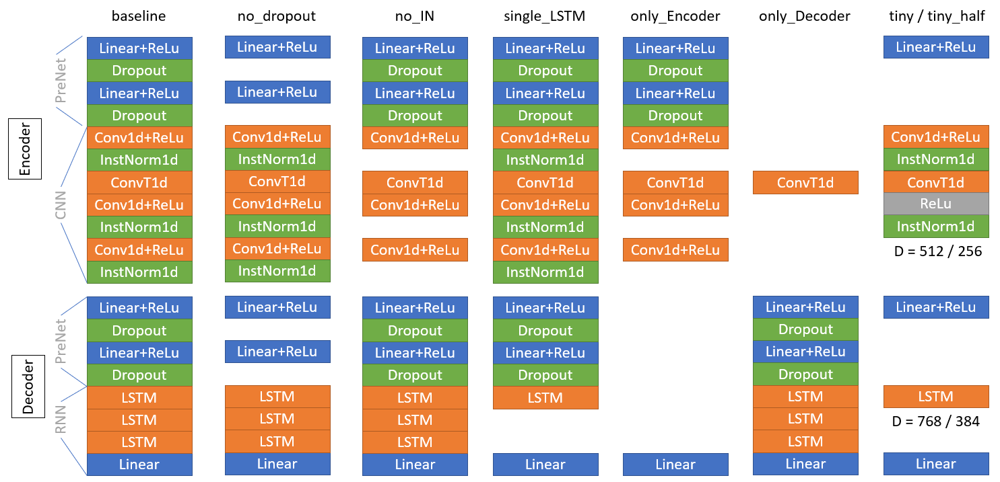

# soft-vc-acoustic-model-ablation-study

    Ablation study on acoustic model of Soft-VC, aming to comprehend and distillate/simplify it.

----

基础代码由 [soft-vc-acoustic-models](https://github.com/Kahsolt/soft-vc-acoustic-models) 删减修改而来，进一步删去了并行训练框架，因为我只有一张卡谔谔 :( 


### Ablation Study Results

We mainly use the standard datasets [DataBaker](https://www.data-baker.com/data/index/TNtts/) (Mandarin) for the following experiments, 
you could test everything alike on [LJSpeech](https://keithito.com/LJ-Speech-Dataset/) (English) by yourself once you have more powerful GPUs :) 

| 语料 | 数据集(dataset) | 说明 | 数据集时长 |
| :-: | :-: | :-: | :-: |
| DataBaker(BZNSYP) | databaker | 汉语普通话女性成人 | 10h |
| LJSpeech-1.1      | databaker | 英语女性成人      | 24h |

You can listen to the audio samples in `index.html`, checkponts could also be downloaded from here [https://pan.quark.cn/s/48dcffa2cddf](https://pan.quark.cn/s/48dcffa2cddf)

#### Ablation on size of training data

Now concerning about **how many data is necessarily needed** to train a satisfactory voice bank.  
We tested the following settings:

| 训练列表(list) | 训练-验证集总时长 |
| :-: | :-: |
| databaker-full  | 10h (full) |
| databaker-8h    | 8h         |
| databaker-4h    | 4h         |
| databaker-2h    | 2h         |
| databaker-1h    | 1h         |
| databaker-30min | 30min      |
| databaker-10min | 10min      |

#### Ablation on model architecture

Now concerning about **what each component functions** in the original soft-vc acoustic model. 
We tested these modified version together with the original CRNN-based acoustic model:

| 模型(model) | 参数量| 说明 |
| :-: | :-: | :-: |
| baseline     | 18,830,336 | original version |
| no_dropout   | 18,830,336 | PreNets do not Dropout in both Encoder and Decoder |
| no_IN        | 18,830,336 | no InstanceNorm1d in Encoder |
| single_LSTM  |  9,380,864 | use only one RNN layer in Decoder |
| only_Encoder |  4,524,544 | only CNN (- IN), no RNN; loss does **NOT** decrease if apply `IN` |
| only_Decoder | 14,896,128 | only (Conv1dT +) RNN , no CNN; `Conv1dT` is added to upsample for length match |
| tiny         |  7,151,104 | tiny version of baseline architecture, collapses all replicated layers/blocks |
| tiny_half    |  2,051,968 | tiny, but model width halfed to `384` |



#### Statistic Results

Collected from demo experiments in `run_experiments.cmd`

| Experiment Setting | Best ckpt Steps | Final Loss (train / valid) | Note | Listening Test |
| :-: | :-: | :-: | :-: | :-: |
| baseline_databaker-full     | 23000 | 0.31 / 0.33745 | 数据集太小，模型太大 | 个别声调错误 |
| baseline_databaker-8h       | 23000 | 0.30 / 0.35051 | 数据集太小，模型太大 | 跨语种时个别音素缺失 |
| baseline_databaker-4h       | 15000 | 0.27 / 0.38186 | 数据集太小，模型太大 | 个别音素缺失导致噪声，声调错误 |
| baseline_databaker-2h       | 5000  | 0.23 / 0.41324 | 快速过拟合，**数据量需求下界** | 个别音素缺失，声调错误 |
| baseline_databaker-1h       | 4000  | 0.18 / 0.43975 | 快速过拟合 | 音素缺失导致近音替换 |
| baseline_databaker-30min    | 3000  | 0.12 / 0.50549 | 快速过拟合 | 音素缺失，声调错误，声音撕裂 |
| baseline_databaker-10min    | 1000  | 0.06 / 0.58868 | 快速过拟合 | 音素缺失导致白噪音替换，撕裂 |
| no_dropout_databaker-full   | 35000 | 0.17 / 0.18310 | ？我不理解，loss最低却仍未过拟合 | 声音更单声道，泛音更少(闷)；更少的汉语口音，但带有源音色模式的成分！ |
| no_IN_databaker-full        | 23000 | 0.31 / 0.33172 | HuBERT本身就有IN的意味，再加IN只能降一点点loss | 汉语口音，音调错误 |
| single_LSTM_databaker-full  | 28000 | 0.34 / 0.42488 | 单层RNN似乎总是非线性性不太够，验证集loss不稳 | 听起来还可以 |
| only_Encoder_databaker-full | 36000 | 0.54 / 0.52248 | 没RNN的话loss降不下来，韵律迁移要靠RNN！ | 微小的撕裂音（什么核嗓） |
| only_Decoder_databaker-full | 26000 | 0.31 / 0.33341 | CNN对于降loss这件事看来用处不大 | 严重的音调错误，听起来像英语🤔？ |
| tiny_databaker-full         | 36000 | 0.18 / 0.18912 | **匹配数据集规模的合理设置** | 听觉效果最好 |
| tiny_half_databaker-full    | 35000 | 0.19 / 0.20307 | 宽度太小非线性性可能不够 | 微小的撕裂音和间歇的高频噪声 |


### Quick Start

#### preprocess

0. download and unzip the dataset [DataBaker](https://www.data-baker.com/data/index/TNtts/) 
1. install dependencies: `pip install -r requirements.txt`
2. perform data preprocess: `mk_preprocess.cmd databaker C:\BZNSYP\Wave`, feature data are generated under `data` folder
3. make training list files: `python make_lists.py databaker`, list files are generated under `lists` folder

#### experiments on size of training data

train using different training list like (by default use `--model baseline`):

  - `python train.py databaker --listfp lists\databaker-full.txt`
  - `python train.py databaker --listfp lists\databaker-1h.txt`
  - `python train.py databaker --listfp lists\databaker-10min.txt`
  - see `lists` folder for all available training list

checkponts and logs are located at `log\<model>-<list>` (e.g. `log\baseline_databaker-1h`)

#### experiments on model architecture

train any acoustic model in the model zoo like

  - `python train.py databaker --listfp lists\databaker-full.txt --model baseline`
  - `python train.py databaker --listfp lists\databaker-full.txt --model no_IN`
  - `python train.py databaker --listfp lists\databaker-full.txt --model single_LSTM`
  - see `python train.py --help` for all available models

checkponts and logs are located at `log\<model>-<list>` (e.g. `log\single_LSTM_databaker-full`)

#### make table view for convenient comparison

1. run `make_infer_test.cmd` to do voice conversion over all trained models on all wavfiles under the `test` folder
2. run `make_index.py` to generated `index.html`, then open it in your browser, now you can check the quality of synthezied results in the table grid


### References

Great thanks again to the founding authors of Soft-VC! :lollipop:  
And also the open-source dataset provider!  :)  

```
@inproceedings{
  soft-vc-2022,
  author={van Niekerk, Benjamin and Carbonneau, Marc-André and Zaïdi, Julian and Baas, Matthew and Seuté, Hugo and Kamper, Herman},
  booktitle={ICASSP}, 
  title={A Comparison of Discrete and Soft Speech Units for Improved Voice Conversion}, 
  year={2022}
}
```

- soft-vc paper: [https://ieeexplore.ieee.org/abstract/document/9746484](https://ieeexplore.ieee.org/abstract/document/9746484)
- soft-vc code: [https://github.com/bshall/soft-vc](https://github.com/bshall/soft-vc)
  - hubert: [https://github.com/bshall/hubert](https://github.com/bshall/hubert)
  - acoustic-model: [https://github.com/bshall/acoustic-model](https://github.com/bshall/acoustic-model)
  - hifigan: [https://github.com/bshall/hifigan](https://github.com/bshall/hifigan)

----

by Armit
2022/09/12 
